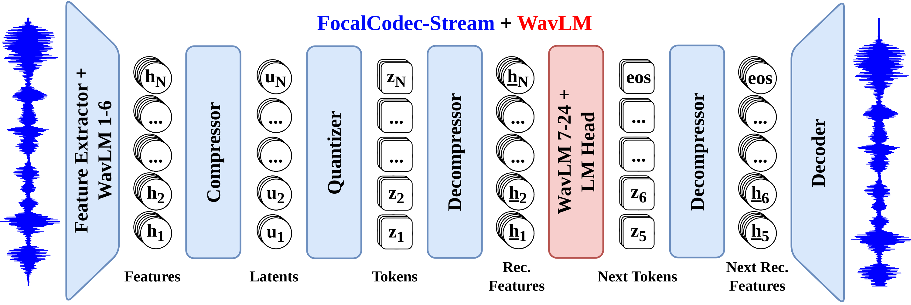

# 🗣️ WavSLM


A single-stream speech language model based on WavLM distillation and
[FocalCodec](https://github.com/lucadellalib/focalcodec).

- 📜 **Paper**: [WavSLM: Single-Stream Speech Language Modeling via WavLM Distillation](https://arxiv.org/abs/2603.05299)

- 🌐 **Project Page**: https://lucadellalib.github.io/wavslm-web/



---------------------------------------------------------------------------------------------------------

## 📌 Available Checkpoints

|  Checkpoint  | Vocabulary | Context Window | Lookahead | Tokens / Step |
|:------------:|:----------:|:--------------:|:---------:|:-------------:|
| `wavslm_2k`  |   2,048    |      512       |     3     |       4       |
| `wavslm_4k`  |   4,096    |      512       |     3     |       4       |
| `wavslm_65k` |   65,536   |      512       |     3     |       4       |

---------------------------------------------------------------------------------------------------------

## 🛠️ Installation

WavSLM requires [Python 3.10 or later](https://www.python.org/). Install
[uv](https://docs.astral.sh/uv/) first:

**macOS and Linux**

```bash
curl -LsSf https://astral.sh/uv/install.sh | sh
```

**Windows PowerShell**

```powershell
powershell -ExecutionPolicy ByPass -c "irm https://astral.sh/uv/install.ps1 | iex"
```

Alternatively, install `uv` with `pipx`:

```bash
pipx install uv
```

Confirm that the command is available:

```bash
uv --version
```

For development, clone the repository and create its locked environment with
Python 3.10:

```bash
git clone https://github.com/lucadellalib/wavslm.git
cd wavslm
uv python install 3.10
uv sync --python 3.10
```

Run commands inside the environment with `uv run`, for example
`uv run python demo.py --help`.

To use WavSLM as a regular Python package without cloning the repository,
install it directly from GitHub:

```bash
pip install wavslm@git+https://github.com/lucadellalib/wavslm.git@main
```

The equivalent installation in a [uv](https://docs.astral.sh/uv/)-managed project is:

```bash
uv add wavslm@git+https://github.com/lucadellalib/wavslm.git@main
```

---------------------------------------------------------------------------------------------------------

## ⚠️ Responsible Use and Playback Safety

WavSLM outputs are stochastic and may contain unexpected, inaccurate, or
inappropriate speech. The authors do not control or endorse generated content;
users are responsible for reviewing outputs and using the model lawfully and
responsibly.

Generated waveforms may also contain clipping or unexpectedly loud segments.
Before playback, inspect or normalize the signal, begin at a low volume, and
increase the level gradually, especially when using headphones.

---------------------------------------------------------------------------------------------------------

## ▶️ Quickstart

**NOTE**: the `audios` directory contains WAV prompts that can be used to
test speech continuation.

You can load WavSLM through PyTorch Hub without cloning the repository:

```python
import torch

model = torch.hub.load(
    repo_or_dir="lucadellalib/wavslm",
    model="wavslm",
    config="lucadellalib/wavslm_4k",
    trust_repo=True,
)
model = model.eval().to("cuda" if torch.cuda.is_available() else "cpu")

# Load the same PCM WAV prompt used by the demo
prompt_path = "audios/prompt_8224-274381-0008.wav"
prompt, sample_rate = model.load_audio(prompt_path)

gen_sig, gen_toks = model.generate(
    bos_sig=prompt,
    sample_rate=sample_rate,
    top_p=0.3,
    top_k=None,
    temp=0.8,
)

# `gen_sig` is already at `sample_rate`
model.save_audio("gen.wav", gen_sig, sample_rate)
```

Alternatively, when WavSLM is installed as a regular Python package (or when
working from a local clone), import the class directly:

```python
from wavslm import WavSLM

model = WavSLM.from_pretrained("lucadellalib/wavslm_4k")
```

`generate` accepts either an audio prompt through `bos_sig` or codec tokens
through `bos_toks`. With no generation limit, waveform prompts generate the
same duration as the prompt and token prompts generate the same number of
tokens. Set either `max_gen_secs` or `max_gen_toks` to override this default.

Fixed-length batched generation is also supported:

```python
# Each prompt is a mono waveform with the same number of samples
batched_prompts = torch.stack([prompt_1, prompt_2])

gen_sig, gen_toks = model.generate(
    bos_sig=batched_prompts,
    sample_rate=16_000,
    top_p=0.3,
    top_k=None,
)
```

The batch shares one sample rate, generation length, and sampling
configuration. Variable-length prompts and padding masks are not currently
supported. Input shape is `(batch, time)`, so stereo channels would be treated
as separate prompts rather than as one stereo signal.

---------------------------------------------------------------------------------------------------------

## 💾 Saving and Loading

WavSLM follows the same configuration lifecycle as FocalCodec:

```python
from wavslm import WavSLM

# Save JSON configuration only
model.to_config("wavslm_4k")

# Save JSON configuration and language-model weights
model.to_pretrained("wavslm_4k")

# Recreate the architecture from a local JSON file
model = WavSLM.from_config("wavslm_4k.json")

# Load local or Hugging Face configuration and weights
model = WavSLM.from_pretrained("wavslm_4k.json")
model = WavSLM.from_pretrained("lucadellalib/wavslm_4k")
```

The WavSLM checkpoint excludes FocalCodec weights to avoid duplication.
`codec_config` in the JSON identifies the matching codec, which is loaded from
its own repository through PyTorch Hub.

Configuration values can be overridden while loading:

```python
model = WavSLM.from_pretrained(
    "lucadellalib/wavslm_4k",
    overrides={"use_flex_attention": True},
)
```

---------------------------------------------------------------------------------------------------------

## 🎤 Running the Demo

From the repository root, run the included demo with [uv](https://docs.astral.sh/uv/).
The entire input WAV is used as the prompt. By default, each generated continuation
has the same duration as the prompt:

```bash
uv run python demo.py \
    --config lucadellalib/wavslm_4k \
    --num-continuations 4 \
    --top-p 0.3 \
    --temp 0.8
```

Four continuations are generated in one batch by default. The generated files
(`gen_<index>_<sample_rate>.wav`), the prompt (`prompt_<sample_rate>.wav`), and
the stitched files (`hyp_<index>_<sample_rate>.wav`) are written to `outputs`
by default. The default prompt is
`audios/prompt_8224-274381-0008.wav`. Run
`uv run python demo.py --help` for all options. Use `--in-wav` to select a
different PCM WAV prompt, `--max-gen-secs` to control the continuation length,
`--num-continuations` to control the batch size, `--device` to select a Torch
device such as `cpu`, `cuda`, or `cuda:1`, and `--out-dir` to change the output
directory. When `--device` is omitted, CUDA is used when available and CPU
otherwise.

---------------------------------------------------------------------------------------------------------

## 📚 Citing

```bibtex
@inproceedings{dellalibera2026wavslm,
    title     = {{WavSLM}: Single-Stream Speech Language Modeling via {WavLM} Distillation},
    author    = {Luca {Della Libera} and Cem Subakan and Mirco Ravanelli},
    booktitle = {Interspeech},
    year      = {2026},
}
```

---------------------------------------------------------------------------------------------------------

## 📧 Contact

[luca.dellalib@gmail.com](mailto:luca.dellalib@gmail.com)

---------------------------------------------------------------------------------------------------------
